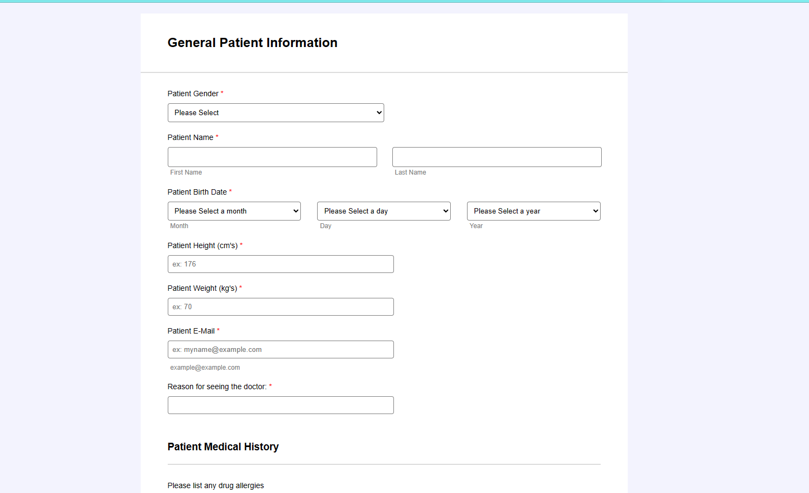
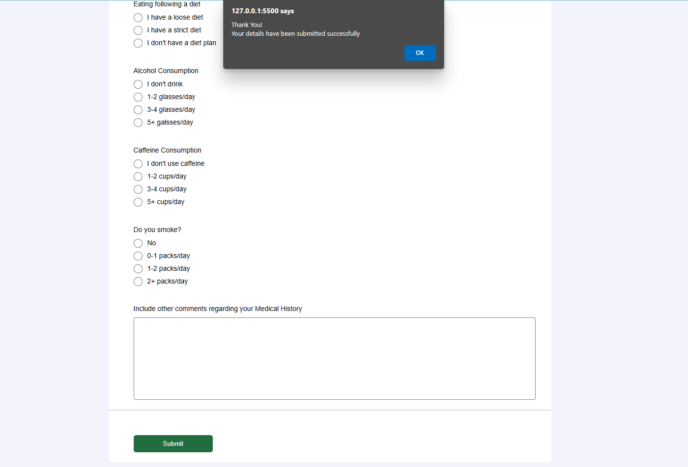

# HTML Practice 9

## Task: Create a Patient Medical History Form and validate using jQuery

Instructions: 
- Clone this Form https://form.jotform.com/240220778597464
- Must have to validate the fields

### Output [Click to visit Project](https://ravi-patel57144.github.io/Cybercom/HTML/Practice_10)

