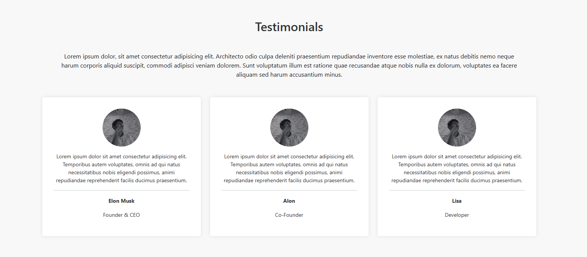

# HTML Practice 2

## Task: Create a HTML page as per below image

Instrucions: 
- You can use properties of CSS as per need.
- you must have to use external style sheets for this HTML page design.

### Output - [Click to visit Project](https://ravi-patel57144.github.io/Cybercom/HTML/Practice_2)

