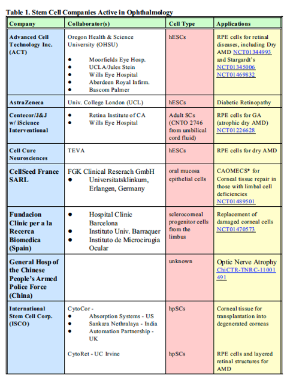
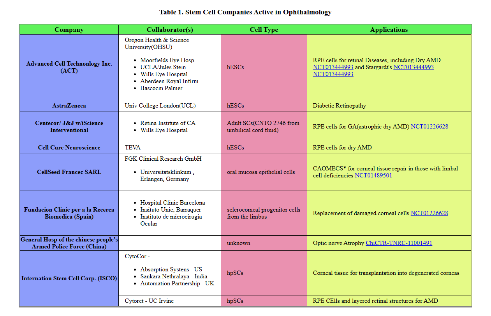

# HTML Practice 4

## Task: Create a HTML page as per given picture using HTML table tags

Instructions:
-

### Output - [Click to visit Project](https://ravi-patel57144.github.io/Cybercom-Creation-Internship-2024/HTML/Practice_4)

