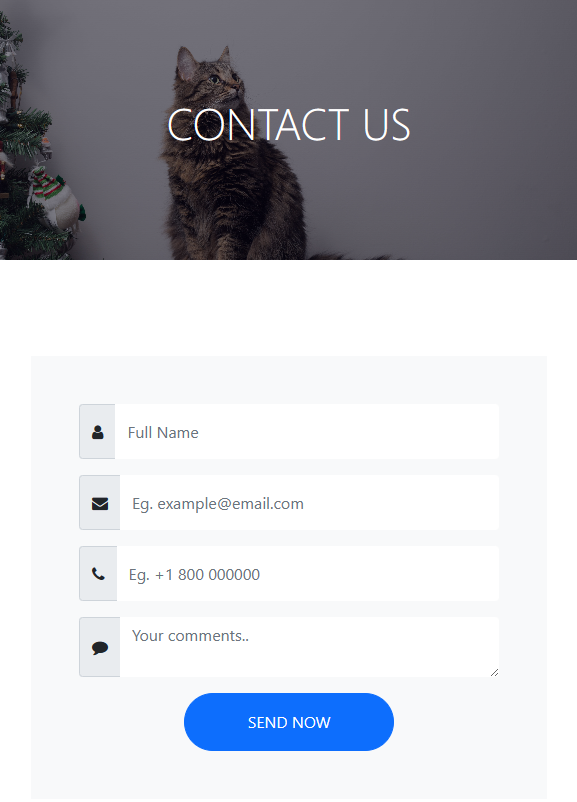
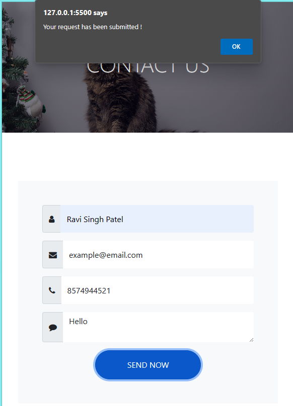

# HTML Practice 5

## Task: Create a HTML page which contains below form

Instructions:
- By clicking on the “Send Now” button, an alert should be displayed with text "Your request has been submitted !"

### Output - [Click to visit Project](https://ravi-patel57144.github.io/Cybercom-Creation-Internship-2024/HTML/Practice_5)

