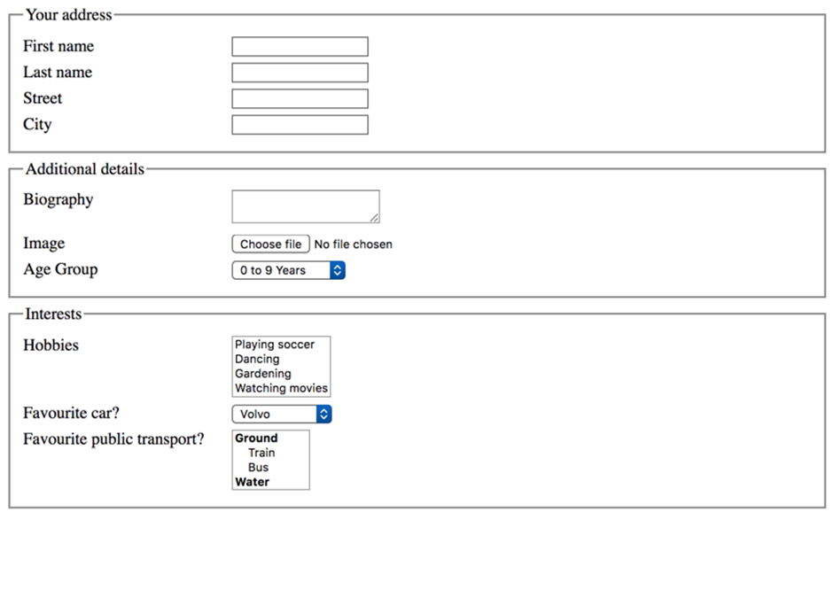
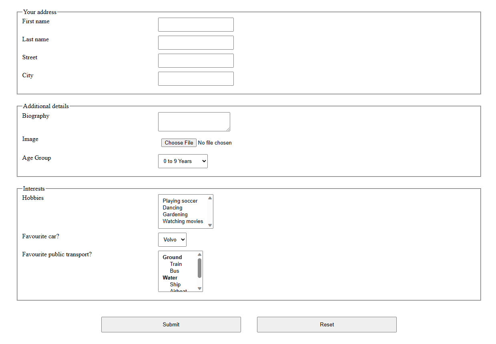

# HTML Practice 6

## Task: Create a HTML page which contains the below form

Instrucions: 
- Add “Submit” and “Reset” Buttons at the end of the form.
- By clicking on “Submit” button , It should be redirect to one “Success.html” page that contains one message as “Form submitted successfully”.

### Output - [Click to visit Project](https://ravi-patel57144.github.io/Cybercom/HTML/Practice_6)

