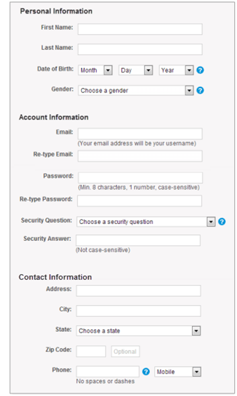
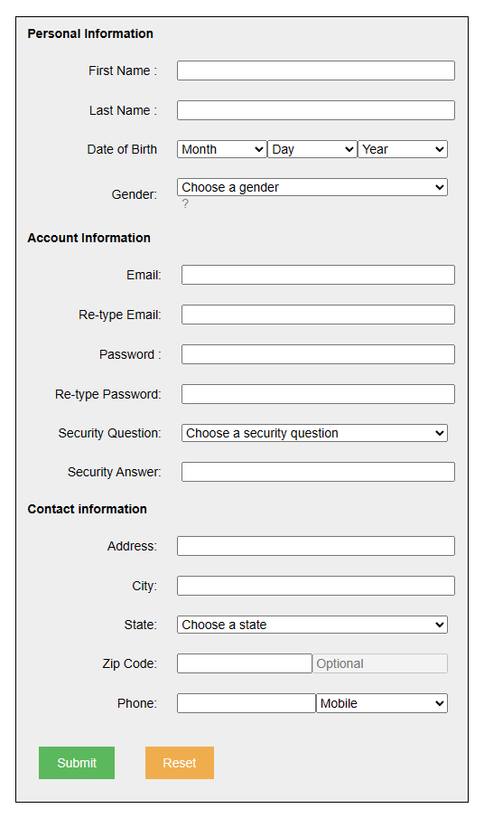
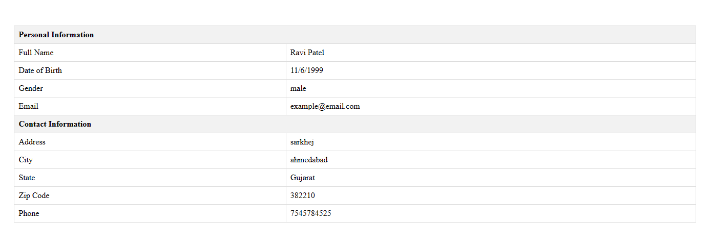

# HTML Practice 7

## Task: Create a HTML page which contains the below form

Instrucions: 
- Add “Submit” and “Reset” Buttons at the end of the form.
- Required fields : First Name, Date of Birth, Email, Password, Phone.
- While clicking on “Submit” button, if all required fields are filled then and then it should be redirect to other page as “Information.php” which contains the given information listed in table format.

### Output - [Click to visit Project](https://ravi-patel57144.github.io/Cybercom/HTML/Practice_7)

