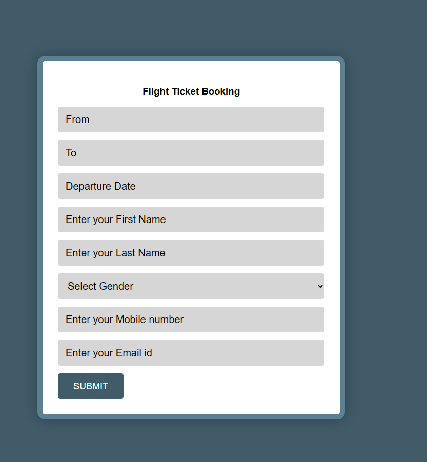
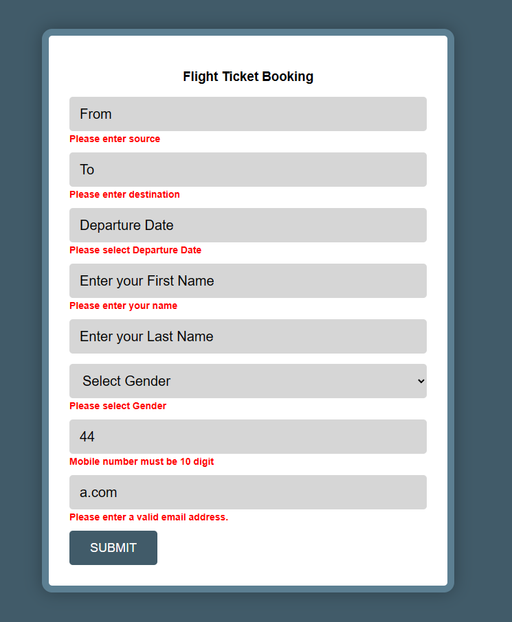

# HTML Practice 9

## Task: Create a Flight Booking Form and validate using jQuery

Instrucions: 
- 

### Output [Click to visit Project](https://ravi-patel57144.github.io/Cybercom/HTML/Practice_9/with_validate)

