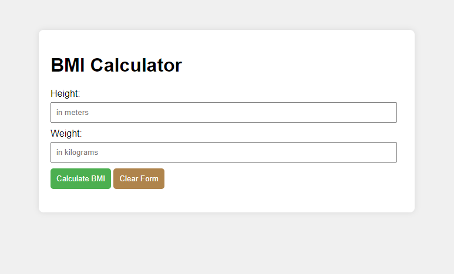
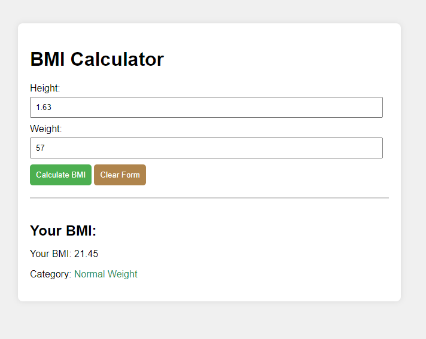

# BMI Calculator

## Task:  Create a BMI calculator web application that takes user input for height and weight and calculates the BMI dynamically

Instructions:
- HTML Structure:
Create an HTML file with input fields for height (in meters) and weight (in kilograms).
Include a button to trigger the BMI calculation.
Display the BMI result on the page.

- JavaScript Logic:
Write JavaScript code to handle the BMI calculation based on the provided formula.
Update the HTML content dynamically to display the calculated BMI.

- BMI Categories:
Implement logic to categorize the BMI result into the standard categories: underweight, normal weight, overweight, and obese.
Display the corresponding category along with the calculated BMI.

- Styling:
Apply CSS styling to make the application visually appealing.
Use different colors or styles for each BMI category to visually distinguish them.

- Validation:
Add input validation to ensure that the user enters valid numerical values for height and weight.
Display appropriate error messages if the input is invalid.

### Output - [Click to visit Project](https://ravi-patel57144.github.io/Cybercom-Creation-Internship-2024/Mini_Apps/BMI_Calculator)

