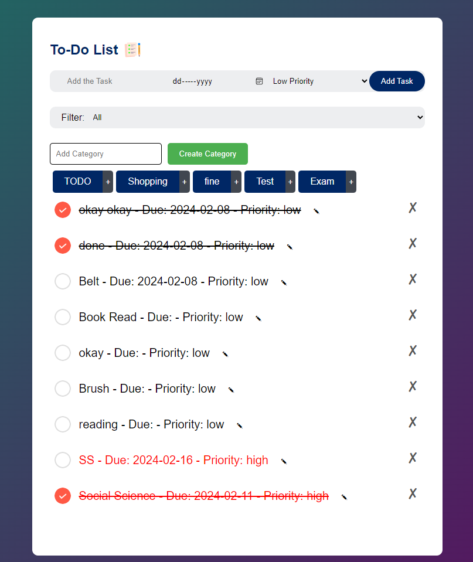

# TODO App

## Task:  Design and develop a user-friendly To-Do List application that allows users to add, edit, and delete tasks. The application should also support task prioritization and due dates.

Instructions:
- User Interface (UI): Create an intuitive and visually appealing interface.
Task Management: Implement functionalities for adding, editing, and deleting tasks.
- Prioritization and Due Dates: Enable users to prioritize tasks and set due dates.
- Once Done with priority and Due Dates add Category option for tasks

### Output - [Click to visit Project](https://ravi-patel57144.github.io/Cybercom-Creation-Internship-2024/Mini_Apps/2_TODO_App)

