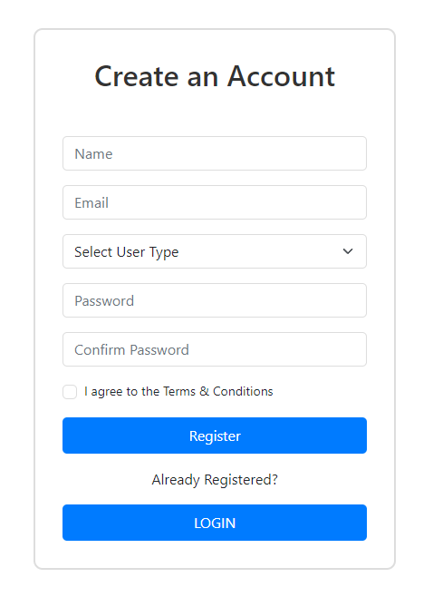
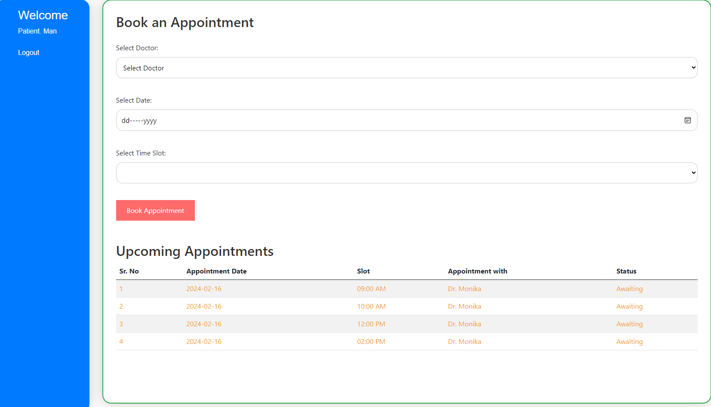
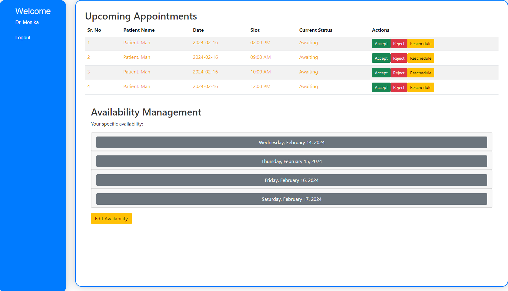
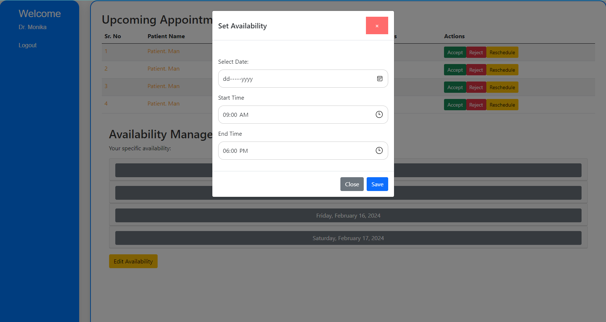
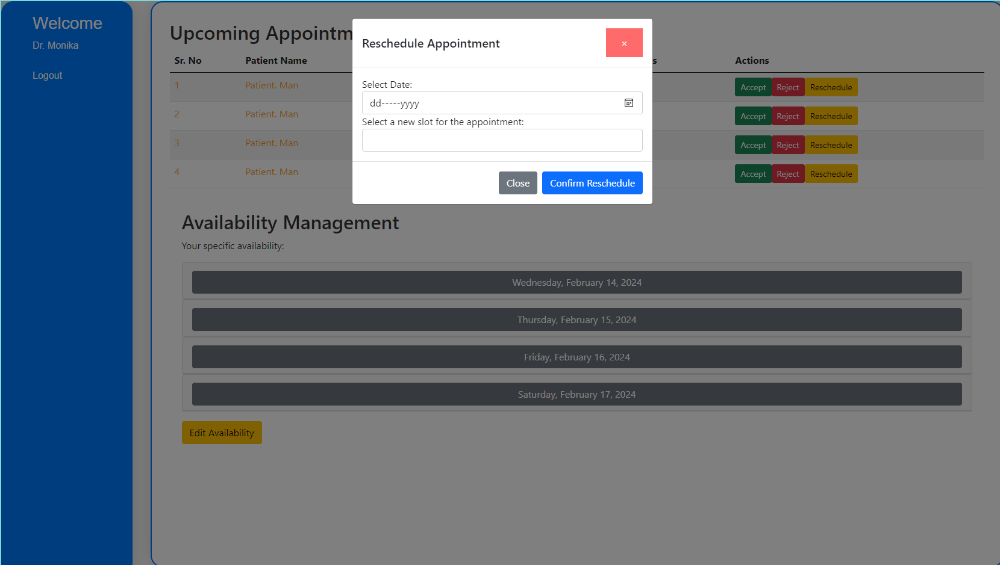

# Online Appointment Booking App

## Task:  In this project, you will be creating a simple online appointment booking application using Vanilla JavaScript, HTML, and CSS. The goal of this project is to understand the fundamentals of JavaScript programming, DOM manipulation, and local storage usage while building a practical application.

Instructions: 
 - User Registration/Login: Users (both doctors and patients) should be able to register for an account or log in if they already have one. Implement simple validation for username and password.

 - Dashboard (patient, doctors): Upon logging in, users should be directed to their respective dashboards. Doctors should be able to see their scheduled appointments, and patients should be able to view their upcoming appointments.
 
 - Appointment Booking: Patients should be able to book appointments with available doctors. Doctors should be able to see their upcoming appointments and manage them (accept, decline, reschedule).

 - Availability Management: Doctors should be able to set their availability, indicating the time slots they are available for appointments.

 - Local Storage Integration: Use local storage to persist user data, appointment details, and availability information. This ensures that the data remains accessible even after the browser is closed and reopened.
 
 - Frontend: Focus on creating a clean and intuitive user interface using HTML and CSS. Ensure that the design is responsive and works well on different screen sizes.

 - JavaScript Logic: Implement the business logic of the application using Vanilla JavaScript. This includes handling user interactions, validating input, managing appointments, and updating the UI accordingly.
 
 - Local Storage Usage: Utilize the browser's local storage API to store and retrieve data such as user credentials, appointment details, and availability information.
 
 - Modularization: Organize your code into separate modules or functions to improve readability and maintainability.

 - Error Handling : Implement error handling to provide feedback to users in case of invalid inputs or other issues.

 - Testing: Test your application thoroughly to ensure that it functions correctly under different scenarios such as booking appointments, managing availability, and handling edge cases.

### Output - [Click to visit Project](https://ravi-patel57144.github.io/Cybercom/Mini_Apps/3_Online_Doctor_App)

- Registration Page
 

- Login Page

- Dashboard Patient

- Dashboard Doctor

- Set Availability

- Reschedule Appointment

- Appointments Statuswise
![appointments]assets/img/(image-6.png)