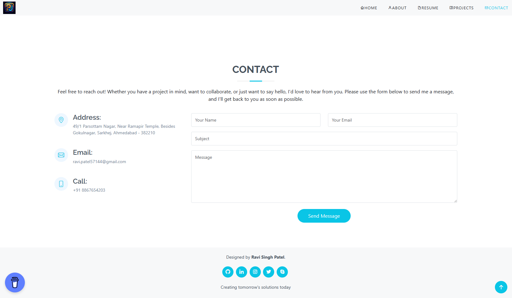

# Personal Portfolio

## Task: Create a simple portfolio webpage that showcases your personal information, skills, and projects.

Instructions:
- Can use externam CSS, Bootstrap

### Output - [Click to visit Project](https://ravi-patel57144.github.io/Cybercom-Creation-Internship-2024/HTML/PortFolio)

#### Home

#### About

#### Resume

#### Projects

#### Contact

